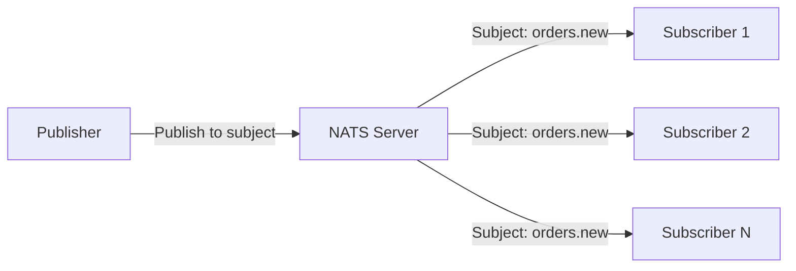
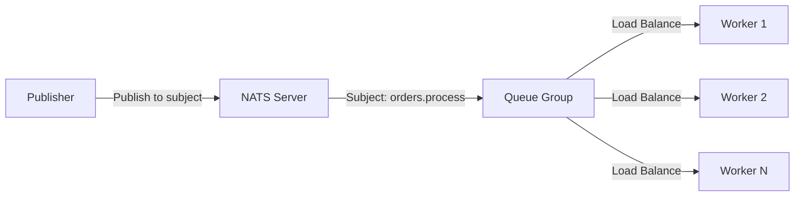
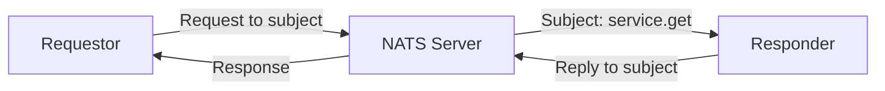

# NATS Streaming Documentation

## Overview

NATS (Neural Autonomic Transport System) is a high-performance messaging system that provides simple, secure, and scalable messaging. This document explains NATS entities, data flow patterns, and how to implement pub/sub messaging.

## NATS Client Naming (`nats.Name`)

### Purpose of Client Names

The `nats.Name("wb-app")` option serves several critical purposes:

1. **Connection Identification**: Uniquely identifies the client connection in NATS server logs and monitoring
2. **Debugging & Monitoring**: Helps track which application/service is connected
3. **Connection Management**: Allows server to distinguish between different client types
4. **Logging & Analytics**: Enables better observability in production environments

### What Happens with Client Names

```go
// In your current code:
nats.Name("wb-app")  // This client will appear as "wb-app" in NATS server logs
```

**Benefits:**
- Server logs show: `[INFO] Client connection "wb-app" connected`
- Monitoring tools can track connections by name
- Easier debugging when multiple services connect

## NATS Core Entities

### 1. **Subjects** (Message Routing)
- **Purpose**: Hierarchical addressing system for message routing
- **Format**: `orders.new`, `orders.processed`, `users.created`
- **Wildcards**: 
  - `*` - single token wildcard (`orders.*`)
  - `>` - multi-token wildcard (`orders.>.*`)

### 2. **Connections** (Client-Server Link)
- **Purpose**: TCP connection between client and NATS server
- **Features**: Auto-reconnection, connection pooling, heartbeat

### 3. **Subscriptions** (Message Consumption)
- **Purpose**: Listen for messages on specific subjects
- **Types**: 
  - Direct subscription
  - Queue subscription (load balancing)

### 4. **Messages** (Data Carriers)
- **Purpose**: Carry application data between publishers and subscribers
- **Features**: Headers, payload, reply-to subject

## Data Flow Patterns

### 1. **Publish-Subscribe (Pub/Sub)**



**Characteristics:**
- One-to-many messaging
- All subscribers receive the message
- No message persistence (fire-and-forget)

### 2. **Queue Groups (Load Balancing)**



**Characteristics:**
- One-to-one messaging within queue group
- Load balancing across workers
- Message delivered to only one worker

### 3. **Request-Reply Pattern**



**Characteristics:**
- Synchronous communication
- Built-in correlation
- Timeout handling


## Monitoring & Debugging

### NATS Server Monitoring
- **Port**: 8222 (as configured in docker-compose)
- **URL**: http://localhost:8222
- **Features**: Connection monitoring, subject statistics, server info