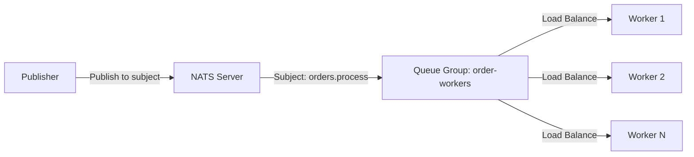

# NATS Load Balancing Documentation

## Overview

NATS provides sophisticated load balancing through Queue Groups. This document covers how NATS distributes messages across multiple workers for efficient processing.

## Queue Groups Explained

### What are Queue Groups?
Queue Groups are named groups of subscribers that share the same subject. NATS automatically distributes messages among workers in the same queue group, ensuring each message is delivered to only one worker.

### Queue Group Diagram



## Load Balancing Mechanisms

### 1. **Round-Robin Distribution**
NATS uses round-robin algorithm to distribute messages:
- Worker 1 gets message 1
- Worker 2 gets message 2  
- Worker 3 gets message 3
- Worker 1 gets message 4 (cycle repeats)

### 2. **Automatic Failover**
- If a worker goes down, messages are redistributed to remaining workers
- No manual intervention required
- Automatic rebalancing when workers come back online

### 3. **Message Affinity**
- Messages are distributed based on availability
- No message is lost during worker failures
- Guaranteed delivery to one worker in the group


## Load Balancing Scenarios

### Scenario 1: Equal Load Distribution
```
Publisher sends: [msg1, msg2, msg3, msg4, msg5, msg6]

Queue Group: order-workers
├── Worker 1: [msg1, msg4]
├── Worker 2: [msg2, msg5]  
└── Worker 3: [msg3, msg6]
```

### Scenario 2: Worker Failure
```
Initial: Worker 1, Worker 2, Worker 3
Failure: Worker 2 goes down
Result: Worker 1, Worker 3 handle all messages
```

### Scenario 3: Worker Recovery
```
During failure: Worker 1, Worker 3
Recovery: Worker 2 comes back online
Result: Automatic rebalancing across all workers
```